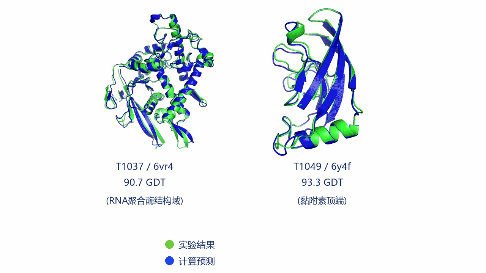

# AlphaFold

本软件包提供了 AlphaFold v2 推理流水线的实现。为方便起见，本文后续统一将该模型称为 AlphaFold。

我们还提供：

1.  AlphaFold-Multimer 的实现。它仍在持续完善中，预期不会像我们的单体版 AlphaFold 系统一样稳定。[可阅读此指南](#更新已有安装)了解如何升级和更新代码。
2.  更新版 AlphaFold v2.3.0 的模型与推理流程说明，见[技术说明](docs/technical_note_v2.3.0.md)。
3.  一套 [CASP15 基线](docs/casp15_predictions.zip)预测结果，以及对应人工干预说明文档。

任何基于本源代码或模型参数得出研究结论的出版物，都应[引用](#引用本文工作) [AlphaFold 论文](https://doi.org/10.1038/s41586-021-03819-2)，并在适用时引用 [AlphaFold-Multimer 论文](https://www.biorxiv.org/content/10.1101/2021.10.04.463034v1)。

关于方法的详细描述，也请参考[补充信息](https://static-content.springer.com/esm/art%3A10.1038%2Fs41586-021-03819-2/MediaObjects/41586_2021_3819_MOESM1_ESM.pdf)。

**你也可以使用社区支持的简化版 AlphaFold（见下文）。**

如果你有任何问题，请通过 [alphafold@deepmind.com](mailto:alphafold@deepmind.com) 联系 AlphaFold 团队。



## 安装并运行第一次预测

你需要一台运行 Linux 的机器；AlphaFold 不支持其他操作系统。完整安装需要最多约 3 TB 磁盘空间来存放遗传数据库（推荐 SSD），并需要一块现代 NVIDIA GPU（显存越大，通常可预测越大的蛋白结构）。

请按以下步骤操作：

1.  安装 [Docker](https://www.docker.com/)。

    *   安装 [NVIDIA Container Toolkit](https://docs.nvidia.com/datacenter/cloud-native/container-toolkit/install-guide.html) 以支持 GPU。
    *   配置[以非 root 用户运行 Docker](https://docs.docker.com/engine/install/linux-postinstall/#manage-docker-as-a-non-root-user)。

1.  克隆本仓库并进入目录。

    ```bash
    git clone https://github.com/deepmind/alphafold.git
    cd ./alphafold
    ```

1.  下载遗传数据库和模型参数：

    *   安装 `aria2c`。在大多数 Linux 发行版中，它可通过包管理器以 `aria2` 软件包形式安装（在 Debian 系发行版中，可运行 `sudo apt install aria2`）。
        `rsync` 和 `parallel` 同理（`sudo apt install rsync parallel`）。

    *   请使用脚本 `scripts/download_all_data.sh` 下载并配置完整数据库。这个过程可能耗时较长（下载量约 556 GB），因此建议在后台运行：

    ```bash
    scripts/download_all_data.sh <DOWNLOAD_DIR> > download.log 2> download_all.log &
    ```

    *   **注意：下载目录 `<DOWNLOAD_DIR>` 不应是 AlphaFold 仓库目录的子目录。** 否则在 Docker 构建时会把大型数据库复制进构建上下文，导致构建明显变慢。

    *   AlphaFold 也可以配合精简版数据库运行；详情请参见[完整文档](#遗传数据库)。

1.  运行以下命令，检查 AlphaFold 是否能够使用 GPU：

    ```bash
    docker run --rm --gpus all nvidia/cuda:11.0-base nvidia-smi
    ```

    该命令的输出应显示你的 GPU 列表。如果没有，请检查是否已正确完成 [NVIDIA Container Toolkit](https://docs.nvidia.com/datacenter/cloud-native/container-toolkit/install-guide.html) 的安装步骤，或参考这个 [NVIDIA Docker issue](https://github.com/NVIDIA/nvidia-docker/issues/1447#issuecomment-801479573)。

    如果你希望使用 Singularity 运行 AlphaFold（它是在 HPC 系统上常见的容器平台），我们建议使用第三方提供的 Singularity 配置，参考：
    https://github.com/deepmind/alphafold/issues/10
    或 https://github.com/deepmind/alphafold/issues/24 。

1.  构建 Docker 镜像：

    ```bash
    docker build -f docker/Dockerfile -t alphafold .
    ```

    如果遇到如下错误：

    ```
    W: GPG error: https://developer.download.nvidia.com/compute/cuda/repos/ubuntu1804/x86_64 InRelease: The following signatures couldn't be verified because the public key is not available: NO_PUBKEY A4B469963BF863CC
    E: The repository 'https://developer.download.nvidia.com/compute/cuda/repos/ubuntu1804/x86_64 InRelease' is not signed.
    ```

    请使用 https://github.com/deepmind/alphafold/issues/463#issuecomment-1124881779 中描述的变通方案。

1.  安装 `run_docker.py` 的依赖。注意：你也可以选择创建一个 [Python 虚拟环境](https://docs.python.org/3/tutorial/venv.html)，以避免与系统 Python 环境发生冲突。

    ```bash
    pip3 install -r docker/requirements.txt
    ```

1.  确保输出目录存在（默认是 `/tmp/alphafold`），并且你拥有足够的写入权限。

1.  运行 `run_docker.py`，并将其指向一个包含待预测蛋白序列的 FASTA 文件（`--fasta_paths` 参数）。AlphaFold 会搜索 `--max_template_date` 参数指定日期之前可用的模板；这可以用来在建模时排除某些模板。`--data_dir` 是下载后的遗传数据库目录，`--output_dir` 是输出目录的绝对路径。

    ```bash
    python3 docker/run_docker.py \
      --fasta_paths=your_protein.fasta \
      --max_template_date=2022-01-01 \
      --data_dir=$DOWNLOAD_DIR \
      --output_dir=/home/user/absolute_path_to_the_output_dir
    ```

1.  运行完成后，输出目录中将包含目标蛋白的预测结构。更多选项与排障提示请见下方文档。

### 遗传数据库

此步骤要求你的机器已安装 `aria2c` 和 `rsync`。同时也强烈建议安装 `GNU Parallel`，以加快解压过程。

AlphaFold 运行时需要多个遗传（序列）数据库：

*   [BFD](https://bfd.mmseqs.com/),
*   [MGnify](https://www.ebi.ac.uk/metagenomics/),
*   [PDB70](http://wwwuser.gwdg.de/~compbiol/data/hhsuite/databases/hhsuite_dbs/),
*   [PDB](https://www.rcsb.org/) (structures in the mmCIF format),
*   [PDB seqres](https://www.rcsb.org/) – only for AlphaFold-Multimer,
*   [UniRef30 (FKA UniClust30)](https://uniclust.mmseqs.com/),
*   [UniProt](https://www.uniprot.org/uniprot/) – only for AlphaFold-Multimer,
*   [UniRef90](https://www.uniprot.org/help/uniref).

我们提供了脚本 `scripts/download_all_data.sh`，可用于下载并配置上述所有数据库：

*   推荐默认方式：

    ```bash
    scripts/download_all_data.sh <DOWNLOAD_DIR>
    ```

    将下载完整数据库。

*   使用 `reduced_dbs` 参数：

    ```bash
    scripts/download_all_data.sh <DOWNLOAD_DIR> reduced_dbs
    ```

    将下载数据库的精简版，以配合 `reduced_dbs` 数据库预设使用。后续运行 AlphaFold 时，需要搭配参数 `--db_preset=reduced_dbs`（详见 [AlphaFold 参数](#运行-alphafold) 一节）。

:ledger: **注意：下载目录 `<DOWNLOAD_DIR>` 不应是 AlphaFold 仓库目录的子目录。** 否则在镜像创建过程中会复制大型数据库，导致 Docker 构建速度变慢。

我们并未提供与 CASP14 完全一致的数据库版本，详情参见[可复现性说明](#关于-casp14-可复现性的说明)。部分数据库提供了镜像以提升速度，见[镜像数据库](#镜像数据库)。

:ledger: **注意：完整数据库的总下载大小约为 556 GB，解压后总大小约为 2.62 TB。请确保你有足够的磁盘空间、带宽和下载时间。为获得更好的遗传搜索性能，推荐使用 SSD。**

:ledger: **注意：如果下载目录和数据集没有完整的读写权限，MSA 工具可能会报错，而且错误信息通常比较晦涩。请确保已正确设置权限，例如可执行 `sudo chmod 755 --recursive "$DOWNLOAD_DIR"`。**

`download_all_data.sh` 脚本也会一并下载模型参数文件。脚本完成后，你的目录结构应大致如下：

```
$DOWNLOAD_DIR/                             # Total: ~ 2.62 TB (download: 556 GB)
    bfd/                                   # ~ 1.8 TB (download: 271.6 GB)
        # 6 files.
    mgnify/                                # ~ 120 GB (download: 67 GB)
        mgy_clusters_2022_05.fa
    params/                                # ~ 5.3 GB (download: 5.3 GB)
        # 5 CASP14 models,
        # 5 pTM models,
        # 5 AlphaFold-Multimer models,
        # LICENSE,
        # = 16 files.
    pdb70/                                 # ~ 56 GB (download: 19.5 GB)
        # 9 files.
    pdb_mmcif/                             # ~ 238 GB (download: 43 GB)
        mmcif_files/
            # About 199,000 .cif files.
        obsolete.dat
    pdb_seqres/                            # ~ 0.2 GB (download: 0.2 GB)
        pdb_seqres.txt
    small_bfd/                             # ~ 17 GB (download: 9.6 GB)
        bfd-first_non_consensus_sequences.fasta
    uniref30/                              # ~ 206 GB (download: 52.5 GB)
        # 7 files.
    uniprot/                               # ~ 105 GB (download: 53 GB)
        uniprot.fasta
    uniref90/                              # ~ 67 GB (download: 34 GB)
        uniref90.fasta
```

只有在下载完整数据库时才会下载 `bfd/`，而 `small_bfd/` 只会在下载精简数据库时下载。

### 模型参数

虽然 AlphaFold 代码采用 Apache 2.0 许可证发布，但 AlphaFold 参数和 CASP15 预测数据是依据 CC BY 4.0 许可证提供的。更多细节请参见下方的[许可与免责声明](#许可与免责声明)。

AlphaFold 参数可从
https://storage.googleapis.com/alphafold/alphafold_params_2022-12-06.tar
获取，并会作为 `scripts/download_all_data.sh` 脚本的一部分下载。该脚本会下载以下参数：

*   5 个在 CASP14 中使用过、并已对结构预测质量进行了充分验证的模型（详见 Jumper et al. 2021，补充方法 1.12）。
*   5 个 pTM 模型，这些模型经过微调，可在给出结构预测的同时输出 pTM（预测 TM-score）和 PAE（预测对齐误差）数值（详见 Jumper et al. 2021，补充方法 1.9.7）。
*   5 个 AlphaFold-Multimer 模型，它们也会在结构预测结果中同时输出 pTM 和 PAE 数值。

### 更新已有安装

如果你之前已经安装过旧版本，可以选择完全重装（删除现有内容并从头重新配置），也可以执行增量更新。后者会快很多，但步骤稍微复杂一些。请务必严格按照下面列出的顺序执行：

1.  **更新代码。**
    *   进入已克隆的 AlphaFold 仓库目录，运行 `git fetch origin main` 获取所有代码更新。
1.  **更新 UniProt、UniRef、MGnify 和 PDB seqres 数据库。**
    *   删除 `<DOWNLOAD_DIR>/uniprot`。
    *   运行 `scripts/download_uniprot.sh <DOWNLOAD_DIR>`。
    *   删除 `<DOWNLOAD_DIR>/uniclust30`。
    *   运行 `scripts/download_uniref30.sh <DOWNLOAD_DIR>`。
    *   删除 `<DOWNLOAD_DIR>/uniref90`。
    *   运行 `scripts/download_uniref90.sh <DOWNLOAD_DIR>`。
    *   删除 `<DOWNLOAD_DIR>/mgnify`。
    *   运行 `scripts/download_mgnify.sh <DOWNLOAD_DIR>`。
    *   删除 `<DOWNLOAD_DIR>/pdb_mmcif`。这样做是为了确保 PDB SeqRes 和 PDB 使用完全相同日期的数据；如果跳过这一步，在运行 AlphaFold-Multimer 时搜索模板可能会报错。
    *   运行 `scripts/download_pdb_mmcif.sh <DOWNLOAD_DIR>`。
    *   运行 `scripts/download_pdb_seqres.sh <DOWNLOAD_DIR>`。
1.  **更新模型参数。**
    *   删除 `<DOWNLOAD_DIR>/params` 中旧的模型参数。
    *   运行 `scripts/download_alphafold_params.sh <DOWNLOAD_DIR>` 下载新的模型参数。
1.  **继续参照 [运行 AlphaFold](#运行-alphafold)。**

#### 使用已弃用的模型权重

若要使用已弃用的 v2.2.0 AlphaFold-Multimer 模型权重：

1.  将 `scripts/download_alphafold_params.sh` 中的 `SOURCE_URL` 改为 `https://storage.googleapis.com/alphafold/alphafold_params_2022-03-02.tar`，然后下载旧参数。
2.  将 `config.py` 中多聚体 `MODEL_PRESETS` 里的 `_v3` 改为 `_v2`。

若要使用已弃用的 v2.1.0 AlphaFold-Multimer 模型权重：

1.  将 `scripts/download_alphafold_params.sh` 中的 `SOURCE_URL` 改为 `https://storage.googleapis.com/alphafold/alphafold_params_2022-01-19.tar`，然后下载旧参数。
2.  删除 `config.py` 中多聚体 `MODEL_PRESETS` 里的 `_v3`。

## 运行 AlphaFold

**运行 AlphaFold 最简单的方式是使用项目自带的 Docker 脚本。** 它已在 Google Cloud 上通过如下配置测试：使用 `nvidia-gpu-cloud-image` 镜像、12 个 vCPU、85 GB 内存、100 GB 启动盘、额外 3 TB 磁盘存放数据库，以及一张 A100 GPU。第一次运行请先参考[安装并运行第一次预测](#安装并运行第一次预测)一节。

1.  默认情况下，AlphaFold 会尝试使用所有可见 GPU 设备。如果只想使用一部分设备，可通过 `--gpu_devices` 参数指定逗号分隔的 GPU UUID 或索引。更多说明请参见 [GPU enumeration](https://docs.nvidia.com/datacenter/cloud-native/container-toolkit/user-guide.html#gpu-enumeration)。

1.  你可以通过添加 `--model_preset=` 参数来控制要运行的 AlphaFold 模型。可选模型如下：

    *   **monomer**：CASP14 中使用的原始单体模型，不使用集成。
    *   **monomer\_casp14**：CASP14 中使用的原始单体模型，`num_ensemble=8`，与我们在 CASP14 中的配置一致。该模式主要用于可复现性，因为计算成本约为 8 倍，而精度提升有限（CASP14 域上平均 GDT 仅提升约 +0.1）。
    *   **monomer\_ptm**：在原始 CASP14 模型基础上加入 pTM 头微调得到的模型，可提供成对置信度指标。它的精度略低于普通单体模型。
    *   **multimer**：这是 [AlphaFold-Multimer](#引用本文工作) 模型。要使用它，需要提供包含多条序列的 FASTA 文件，并且必须先下载 UniProt 数据库。

1.  你可以通过在运行命令中添加 `--db_preset=reduced_dbs` 或 `--db_preset=full_dbs`，在 MSA 速度和质量之间进行权衡。可选预设如下：

    *   **reduced\_dbs**：该预设针对速度和较低硬件要求做了优化，使用精简版 BFD 数据库。需要 8 个 CPU 核心（vCPU）、8 GB 内存和 600 GB 磁盘空间。
    *   **full\_dbs**：使用 CASP14 中用到的全部遗传数据库。

    如果使用 `monomer` 模型预设和 `reduced_dbs` 数据预设，命令示例如下：

    ```bash
    python3 docker/run_docker.py \
      --fasta_paths=T1050.fasta \
      --max_template_date=2020-05-14 \
      --model_preset=monomer \
      --db_preset=reduced_dbs \
      --data_dir=$DOWNLOAD_DIR \
      --output_dir=/home/user/absolute_path_to_the_output_dir
    ```

1.  生成预测模型后，AlphaFold 会执行一次弛豫步骤，以改善局部几何结构。默认只会弛豫最佳模型（按 pLDDT 排序，对应 `--models_to_relax=best`），你也可以选择弛豫全部模型（`--models_to_relax=all`）或完全不弛豫（`--models_to_relax=none`）。

1.  弛豫步骤既可以在 GPU 上运行（更快，但可能稍微不稳定），也可以在 CPU 上运行（更慢，但更稳定）。可通过 `--enable_gpu_relax=true`（默认）或 `--enable_gpu_relax=false` 控制。

1.  AlphaFold 可以通过 `--use_precomputed_msas=true` 复用同一条序列先前生成的 MSA（多序列比对），这在尝试不同 AlphaFold 参数时很有用。该选项要求第一次运行 AlphaFold 时在输出目录下生成的目录结构仍然存在，且蛋白序列保持不变。

### 运行 AlphaFold-Multimer

运行步骤与单体系统基本相同，但你需要：

*   提供一个包含多条序列的输入 FASTA 文件；
*   设置 `--model_preset=multimer`。

例如，对蛋白复合物 `multimer.fasta` 进行预测的命令如下：

```bash
python3 docker/run_docker.py \
  --fasta_paths=multimer.fasta \
  --max_template_date=2020-05-14 \
  --model_preset=multimer \
  --data_dir=$DOWNLOAD_DIR \
  --output_dir=/home/user/absolute_path_to_the_output_dir
```

默认情况下，多聚体系统会对每个模型运行 5 个随机种子（总计 25 次预测）。如果你愿意接受轻微的精度下降，可以只为每个模型运行 1 个随机种子。可通过 `--num_multimer_predictions_per_model` 参数控制，例如设置为 `--num_multimer_predictions_per_model=1`。

### AlphaFold 预测速度

下表给出了不同长度蛋白的预测耗时。这里只统计不含弛豫的结构预测时间，使用 3 次 recycle，并且不计入 MSA 与模板搜索时间。运行 `docker/run_docker.py` 且设置 `--benchmark=true` 时，该时间会记录在 `timings.json` 中。所有耗时均来自单张 NVIDIA A100 GPU。对于更小的结构，可通过增大 `alphafold/model/config.py` 中的 `global_config.subbatch_size` 来提升 A100 上的预测速度。

残基数 | 预测时间（秒）
-----------: | ------------------:
100          | 4.9
200          | 7.7
300          | 13
400          | 18
500          | 29
600          | 36
700          | 53
800          | 60
900          | 91
1,000        | 96
1,100        | 140
1,500        | 280
2,000        | 450
2,500        | 969
3,000        | 1,240
3,500        | 2,465
4,000        | 5,660
4,500        | 12,475
5,000        | 18,824

### 示例

下面给出几种不同场景下使用 AlphaFold 的示例。

#### 预测单体

假设我们有一个单体，其序列为 `<SEQUENCE>`。输入 FASTA 应如下所示：

```fasta
>sequence_name
<SEQUENCE>
```

然后运行以下命令：

```bash
python3 docker/run_docker.py \
  --fasta_paths=monomer.fasta \
  --max_template_date=2021-11-01 \
  --model_preset=monomer \
  --data_dir=$DOWNLOAD_DIR \
  --output_dir=/home/user/absolute_path_to_the_output_dir
```

#### 预测同源多聚体

假设我们有一个由 3 份相同序列 `<SEQUENCE>` 组成的同源多聚体。输入 FASTA 应如下所示：

```fasta
>sequence_1
<SEQUENCE>
>sequence_2
<SEQUENCE>
>sequence_3
<SEQUENCE>
```

然后运行以下命令：

```bash
python3 docker/run_docker.py \
  --fasta_paths=homomer.fasta \
  --max_template_date=2021-11-01 \
  --model_preset=multimer \
  --data_dir=$DOWNLOAD_DIR \
  --output_dir=/home/user/absolute_path_to_the_output_dir
```

#### 预测异源多聚体

假设我们有一个 A2B3 异源多聚体，即包含 2 份 `<SEQUENCE A>` 和 3 份 `<SEQUENCE B>`。输入 FASTA 应如下所示：

```fasta
>sequence_1
<SEQUENCE A>
>sequence_2
<SEQUENCE A>
>sequence_3
<SEQUENCE B>
>sequence_4
<SEQUENCE B>
>sequence_5
<SEQUENCE B>
```

然后运行以下命令：

```bash
python3 docker/run_docker.py \
  --fasta_paths=heteromer.fasta \
  --max_template_date=2021-11-01 \
  --model_preset=multimer \
  --data_dir=$DOWNLOAD_DIR \
  --output_dir=/home/user/absolute_path_to_the_output_dir
```

#### 依次预测多个单体

假设我们有两个单体：`monomer1.fasta` 和 `monomer2.fasta`。

可以使用以下命令按顺序依次预测它们：

```bash
python3 docker/run_docker.py \
  --fasta_paths=monomer1.fasta,monomer2.fasta \
  --max_template_date=2021-11-01 \
  --model_preset=monomer \
  --data_dir=$DOWNLOAD_DIR \
  --output_dir=/home/user/absolute_path_to_the_output_dir
```

#### 依次预测多个多聚体

假设我们有两个多聚体：`multimer1.fasta` 和 `multimer2.fasta`。

可以使用以下命令按顺序依次预测它们：

```bash
python3 docker/run_docker.py \
  --fasta_paths=multimer1.fasta,multimer2.fasta \
  --max_template_date=2021-11-01 \
  --model_preset=multimer \
  --data_dir=$DOWNLOAD_DIR \
  --output_dir=/home/user/absolute_path_to_the_output_dir
```

### AlphaFold 输出

输出结果会保存在 `run_docker.py` 的 `--output_dir` 参数所指定目录的子目录中（默认是 `/tmp/alphafold/`）。输出内容包括计算得到的 MSA、未弛豫结构、弛豫后结构、排序后结构、原始模型输出、预测元数据以及各阶段耗时。`--output_dir` 目录结构如下：

```
<target_name>/
    features.pkl
    ranked_{0,1,2,3,4}.pdb
    ranking_debug.json
    relax_metrics.json
    relaxed_model_{1,2,3,4,5}.pdb
    result_model_{1,2,3,4,5}.pkl
    timings.json
    unrelaxed_model_{1,2,3,4,5}.pdb
    msas/
        bfd_uniref_hits.a3m
        mgnify_hits.sto
        uniref90_hits.sto
```

各输出文件的内容如下：

*   `features.pkl`：`pickle` 文件，包含模型生成结构时使用的输入特征 NumPy 数组。
*   `unrelaxed_model_*.pdb`：PDB 格式文本文件，内容为模型直接输出的预测结构。
*   `relaxed_model_*.pdb`：PDB 格式文本文件，内容为对未弛豫预测结构执行 Amber 弛豫流程后的结果（详见 Jumper et al. 2021，补充方法 1.8.6）。
*   `ranked_*.pdb`：PDB 格式文本文件，内容为按模型置信度重新排序后的预测结构。这里 `ranked_i.pdb` 表示第 `i + 1` 高置信度的预测结果，因此 `ranked_0.pdb` 置信度最高。模型排序使用预测 LDDT（pLDDT）分数（详见 Jumper et al. 2021，补充方法 1.9.6）。如果设置 `--models_to_relax=all`，则所有排序后的结构都会被弛豫；如果设置 `--models_to_relax=best`，则只有 `ranked_0.pdb` 会被弛豫；如果设置 `--models_to_relax=none`，则所有排序后的结构都保持未弛豫状态。
*   `ranking_debug.json`：JSON 格式文本文件，包含用于模型排序的 pLDDT 值，以及与原始模型名称之间的映射关系。
*   `relax_metrics.json`：JSON 格式文本文件，包含弛豫指标，例如剩余违规项。
*   `timings.json`：JSON 格式文本文件，包含 AlphaFold 流水线各部分的运行耗时。
*   `msas/`：目录，包含构建输入 MSA 时使用的各类遗传工具命中文件。
*   `result_model_*.pkl`：`pickle` 文件，包含模型直接生成的多个 NumPy 数组组成的嵌套字典。除结构模块输出外，还包括以下辅助输出：

    *   Distogram（`distogram/logits` 包含形状为 `[N_res, N_res, N_bins]` 的 NumPy 数组，`distogram/bin_edges` 包含分箱定义）。
    *   每残基 pLDDT 分数（`plddt` 是形状为 `[N_res]` 的 NumPy 数组，取值范围为 `0` 到 `100`，其中 `100` 表示置信度最高）。它可用于识别高置信度预测的序列区域，也可在对残基取平均后作为整体目标的置信度分数。
    *   仅在使用 pTM 模型时提供：预测 TM-score（`ptm` 字段为标量）。作为全局叠合指标的预测量，它也用于评估模型对整体结构域堆积是否有信心。
    *   仅在使用 pTM 模型时提供：预测成对对齐误差（`predicted_aligned_error` 是形状为 `[N_res, N_res]` 的 NumPy 数组，取值范围为 `0` 到 `max_predicted_aligned_error`，其中 `0` 表示置信度最高）。它可用于可视化结构内部结构域堆积的置信度。

pLDDT 置信度指标会保存在输出 PDB 文件的 B-factor 字段中（但与传统 B-factor 不同，pLDDT 越高越好，因此在分子置换等任务中使用时需要特别注意）。

该代码已经过测试：在使用 5 个模型预测、并按 pLDDT 排序的 CASP14 测试集上，其平均 top-1 精度与我们报告结果一致（部分 CASP 目标使用的是更早版本的 AlphaFold，且部分目标进行了人工干预，详见后续论文）。像 T1064 这样的目标在不同随机种子下也可能出现较高的单次运行方差。

## 批量推理多个蛋白

项目自带的推理脚本针对单个蛋白结构预测做了优化，它会将神经网络编译为恰好适配该序列、MSA 和模板大小的版本。对于大蛋白，编译时间在总运行时间中的占比通常可以忽略；但对于小蛋白，或者当多序列比对已经预先计算好时，编译时间的影响会更明显。在批量推理场景下，可以考虑使用我们的 `make_fixed_size` 函数，将输入填充到统一大小，从而减少编译次数。

我们没有提供专门的批量推理脚本，但基于 `RunModel.predict` 方法，再配合一个并行的多序列比对预计算系统，开发起来应该并不困难。另一种做法是重复运行当前脚本，其额外开销也还算可接受。

## 关于 CASP14 可复现性的说明

对于少数蛋白，AlphaFold 的输出在不同运行之间会有较高方差，并且可能受到输入数据变化的影响。CASP14 目标 T1064 就是一个典型例子；近期大量与 SARS-CoV-2 相关的序列入库，显著改变了它的 MSA。这种波动在一定程度上会被模型筛选过程缓解，即运行 5 个模型并选择最有信心的结果。

如果你希望尽可能接近地复现我们在 CASP14 系统中的结果，就必须使用与我们当时相同版本的数据库。这些版本可能与我们脚本默认下载的版本并不一致。

遗传数据库方面：

*   UniRef90:
    [v2020_01](https://ftp.uniprot.org/pub/databases/uniprot/previous_releases/release-2020_01/uniref/)
*   MGnify:
    [v2018_12](http://ftp.ebi.ac.uk/pub/databases/metagenomics/peptide_database/2018_12/)
*   Uniclust30: [v2018_08](http://wwwuser.gwdg.de/~compbiol/uniclust/2018_08/)
*   BFD: [only version available](https://bfd.mmseqs.com/)

模板数据库方面：

*   PDB: (downloaded 2020-05-14)
*   PDB70:
    [2020-05-13](http://wwwuser.gwdg.de/~compbiol/data/hhsuite/databases/hhsuite_dbs/old-releases/pdb70_from_mmcif_200513.tar.gz)

另一种模板方案是使用最新的 PDB 和 PDB70，但同时传入 `--max_template_date=2020-05-14` 参数，将模板限制为 CASP14 开始时已可用的结构。

## 引用本文工作

如果你在工作中使用了本软件包中的代码或数据，请引用：

```bibtex
@Article{AlphaFold2021,
  author  = {Jumper, John and Evans, Richard and Pritzel, Alexander and Green, Tim and Figurnov, Michael and Ronneberger, Olaf and Tunyasuvunakool, Kathryn and Bates, Russ and {\v{Z}}{\'\i}dek, Augustin and Potapenko, Anna and Bridgland, Alex and Meyer, Clemens and Kohl, Simon A A and Ballard, Andrew J and Cowie, Andrew and Romera-Paredes, Bernardino and Nikolov, Stanislav and Jain, Rishub and Adler, Jonas and Back, Trevor and Petersen, Stig and Reiman, David and Clancy, Ellen and Zielinski, Michal and Steinegger, Martin and Pacholska, Michalina and Berghammer, Tamas and Bodenstein, Sebastian and Silver, David and Vinyals, Oriol and Senior, Andrew W and Kavukcuoglu, Koray and Kohli, Pushmeet and Hassabis, Demis},
  journal = {Nature},
  title   = {Highly accurate protein structure prediction with {AlphaFold}},
  year    = {2021},
  volume  = {596},
  number  = {7873},
  pages   = {583--589},
  doi     = {10.1038/s41586-021-03819-2}
}
```

此外，如果你使用了 AlphaFold-Multimer 模式，请同时引用：

```bibtex
@article {AlphaFold-Multimer2021,
  author       = {Evans, Richard and O{\textquoteright}Neill, Michael and Pritzel, Alexander and Antropova, Natasha and Senior, Andrew and Green, Tim and {\v{Z}}{\'\i}dek, Augustin and Bates, Russ and Blackwell, Sam and Yim, Jason and Ronneberger, Olaf and Bodenstein, Sebastian and Zielinski, Michal and Bridgland, Alex and Potapenko, Anna and Cowie, Andrew and Tunyasuvunakool, Kathryn and Jain, Rishub and Clancy, Ellen and Kohli, Pushmeet and Jumper, John and Hassabis, Demis},
  journal      = {bioRxiv},
  title        = {Protein complex prediction with AlphaFold-Multimer},
  year         = {2021},
  elocation-id = {2021.10.04.463034},
  doi          = {10.1101/2021.10.04.463034},
  URL          = {https://www.biorxiv.org/content/early/2021/10/04/2021.10.04.463034},
  eprint       = {https://www.biorxiv.org/content/early/2021/10/04/2021.10.04.463034.full.pdf},
}
```

## 社区贡献

以下是社区提供的 Colab 笔记本（请注意，这些笔记本可能与我们的完整 AlphaFold 系统存在差异，我们也没有验证其准确性）：

*   [ColabFold AlphaFold2 notebook](https://colab.research.google.com/github/sokrypton/ColabFold/blob/main/AlphaFold2.ipynb)，作者为 Martin Steinegger、Sergey Ovchinnikov 和 Milot Mirdita。它使用了部署在 Södinglab 上、基于 MMseqs2 服务器的 API [(Mirdita et al. 2019, Bioinformatics)](https://academic.oup.com/bioinformatics/article/35/16/2856/5280135) 来生成多序列比对。

## 致谢

AlphaFold 会与下列独立库和软件包交互，或引用它们：

*   [Abseil](https://github.com/abseil/abseil-py)
*   [Biopython](https://biopython.org)
*   [Colab](https://research.google.com/colaboratory/)
*   [Docker](https://www.docker.com)
*   [HH Suite](https://github.com/soedinglab/hh-suite)
*   [HMMER Suite](http://eddylab.org/software/hmmer)
*   [GNU Parallel](https://www.gnu.org/software/parallel/)
*   [Haiku](https://github.com/deepmind/dm-haiku)
*   [JAX](https://github.com/google/jax/)
*   [Kalign](https://msa.sbc.su.se/cgi-bin/msa.cgi)
*   [matplotlib](https://matplotlib.org/)
*   [ML Collections](https://github.com/google/ml_collections)
*   [NumPy](https://numpy.org)
*   [OpenMM](https://github.com/openmm/openmm)
*   [OpenStructure](https://openstructure.org)
*   [pymol3d](https://github.com/avirshup/py3dmol)
*   [Sonnet](https://github.com/deepmind/sonnet)
*   [TensorFlow](https://github.com/tensorflow/tensorflow)
*   [Tree](https://github.com/deepmind/tree)
*   [tqdm](https://github.com/tqdm/tqdm)

感谢所有相关贡献者和维护者！

## 联系我们

如果你有本概览未涵盖的问题，请通过 [alphafold@deepmind.com](mailto:alphafold@deepmind.com) 联系 AlphaFold 团队。

我们也非常希望听到你的反馈，并了解 AlphaFold 如何帮助了你的研究。欢迎通过 [alphafold@deepmind.com](mailto:alphafold@deepmind.com) 与我们分享你的故事。

## 许可与免责声明

这不是 Google 官方支持的产品。

版权所有 2022 DeepMind Technologies Limited。

AlphaFold 2 及其输出仅用于理论建模。它们并非为临床用途设计、验证或批准。你不应将 AlphaFold 2 或其输出用于临床目的，也不应将其作为医疗或其他专业建议的依据。凡涉及这些主题的内容均仅供信息参考，不能替代合格专业人士的建议。

AlphaFold 2 的输出属于置信度不一的预测结果，应谨慎解读。在依赖、发布、下载或以其他方式使用 AlphaFold 2 及其输出之前，请自行审慎判断。

### AlphaFold 代码许可证

本代码依据 Apache License 2.0 版本（下称 “License”）授权；除非遵守该许可证，否则你不得使用本文件。你可以在 https://www.apache.org/licenses/LICENSE-2.0 获取许可证全文。

除非适用法律要求或书面同意，依据许可证分发的软件均按“原样”提供，不附带任何明示或暗示的担保或条件。有关许可证所适用的具体权限与限制，请参阅许可证正文。

### 模型参数许可证

AlphaFold 参数依据 Creative Commons Attribution 4.0 International（CC BY 4.0）许可证提供，详情见：https://creativecommons.org/licenses/by/4.0/legalcode

### 第三方软件

上文[致谢](#致谢)部分提及的第三方软件、库或代码，其使用可能受独立的条款、条件或许可证约束。你对这些第三方软件、库或代码的使用受相应条款约束，因此在使用前请确认自己能够遵守相关限制与条件。

### 镜像数据库

以下数据库由 DeepMind 提供了镜像，可参考如下说明：

*   [BFD](https://bfd.mmseqs.com/)（未修改版本），作者为 Steinegger M. 和 Söding J.，依据 [Creative Commons Attribution-ShareAlike 4.0 International License](http://creativecommons.org/licenses/by-sa/4.0/) 提供。

*   [BFD](https://bfd.mmseqs.com/)（修改版本），原作者为 Steinegger M. 和 Söding J.，由 DeepMind 修改，依据 [Creative Commons Attribution-ShareAlike 4.0 International License](http://creativecommons.org/licenses/by-sa/4.0/) 提供。详情请见 [AlphaFold proteome paper](https://www.nature.com/articles/s41586-021-03828-1) 的 Methods 部分。

*   [Uniref30: v2021_03](http://wwwuser.gwdg.de/~compbiol/uniclust/2021_03/)（未修改版本），作者为 Mirdita M. 等，依据 [Creative Commons Attribution-ShareAlike 4.0 International License](http://creativecommons.org/licenses/by-sa/4.0/) 提供。

*   [MGnify: v2022_05](http://ftp.ebi.ac.uk/pub/databases/metagenomics/peptide_database/2022_05/README.txt)（未修改版本），作者为 Mitchell AL 等，免除全部版权限制，并依据 [CC0 1.0 Universal (CC0 1.0) Public Domain Dedication](https://creativecommons.org/publicdomain/zero/1.0/) 免费提供给非商业和商业用途使用。
